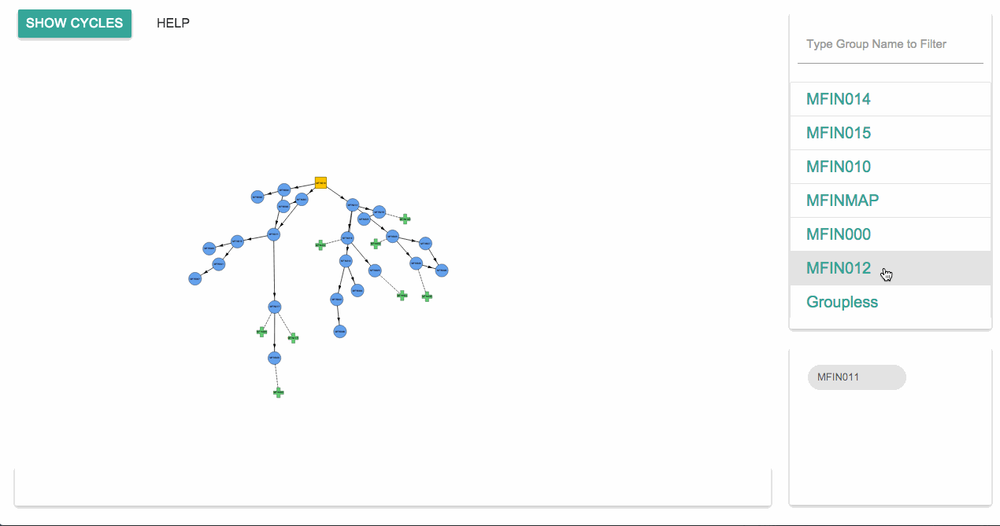
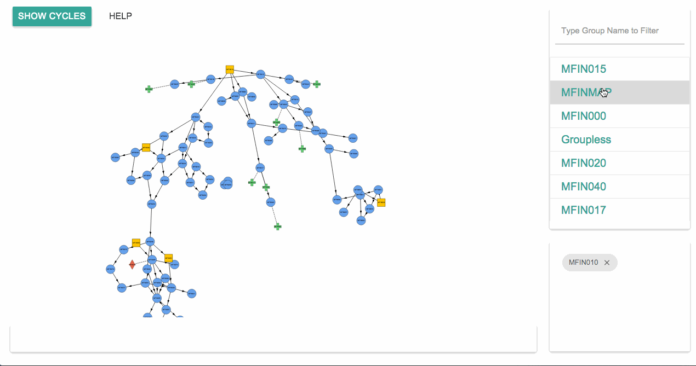

#Graph Visualisation Software 
##created for [Siyavula](http://www.siyavula.com/) as a 3rd year Computer Science Project at the University of Cape Town

###Description
This software parses data from a .map file, converts it into a JSON file, spins up a local python webserver on port 8000. You are then able to filter the data in groups, zoom, drag, hover for information, remove data, search for groups.

There is also the ability to show cyclical dependencies in the data

###Setup
This package will achieve the following:

1. Parse the data from all .map files in the root folder
2. create python objects from the data
3. output a JSON file called data.json with the necessary node, edge and group information
4. Start a server that will render a visualization of the nodes and edges on localhost:8000

To setup the environment to run the software:

1. ensure that python, virtualenv and python-pip package are installed/working on your machine 
2. run the following: `sudo sh setup.sh`

To run the program:

1. move the .map files that you want to process, into the root folder
2. run the following: `sh run.sh`
3. Then navigate to localhost:8000 on Chrome (it will not work on another browser)

To stop the server hosting the visualization: `ctrl + c`

To run the tests: `sh test.sh`

To run the tests with coverage reports: `sh testcov.sh`

###Disclaimers
1. The parsing only works with Siyavula's proprietary data format. Some examples .map files have been created in the `/test_content` directory. For a dummy example, these can be copied in to the root folder and processed as above.
2. This will only work on Chrome
3. This code has not been tested on a Windows Machine, only on OSX and Linux- Ubuntu. Please run this code on a unix machine.
4. For the above code to run, please ensure that virtualenv and the python-pip package are installed on your machine. They are not installed on the UCT Senior Lab computers and require permission from admin to be installed.
